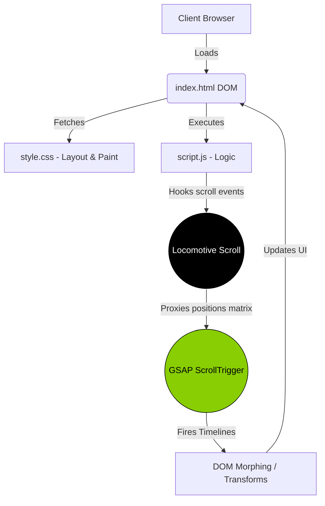

# 🪀 LAZAREV. Digital Product Design Agency

> **[🎬 Watch the Full Video Demo Here](#)** *(Link to be added)*


## 1. High-Level Overview (The "50,000-Foot" View)

### 🎯 Defining the Goal
The LAZAREV. clone is an immersive, high-performance web experience built to replicate an Awwwards-winning digital agency site. The primary goal is to capture user attention using fluid, scroll-linked animations, micro-interactions, and a brutalist-inspired dark mode aesthetic that translates a standard portfolio into a dynamic storytelling medium.

### 🎭 The Analogy
Think of a traditional website like a **Brochure**—information mapped statically on paper.  
This application, instead, is an **Interactive Art Exhibit**:
*   The **HTML** is the architecture of the museum.
*   The **CSS** creates the atmospheric lighting and spacing.
*   The **JavaScript (GSAP + Locomotive)** acts as your personal curator, gracefully transitioning your viewport from one exhibit to the next based exactly on your movements (scrolls).

### 🏛️ System Architecture Visualization
To understand how the UI, Scrolling Engine, and Animation Engine interlock:



---

## 2. Tailor to the Audience

### 👨‍💼 For Managers & Non-Technical Stakeholders
**Why does this matter?** 
Users judge a business's credibility in less than 50 milliseconds. This project leverages motion design—such as elements gracefully fading in or a custom cursor reacting to links—to convey absolute premium quality, establishing immediate trust. It turns a static reading experience into an engaging cinematic journey, reducing bounce rates and intuitively guiding the user toward the "Let's Talk" call-to-action.

### 👨‍💻 For Technical Peers & Developers
**The Architecture "Why"** 
Rather than relying on standard native scrolling and complex CSS keyframes (which can cause DOM thrashing and staggered framerates), we employ **GSAP** coupled with **Locomotive Scroll**. 
*   **Why Locomotive?** It hijacks native scrolling to establish "Smooth Scrolling" via CSS Transforms (`translate3d`), unlocking hardware acceleration.
*   **Why GSAP Proxy?** Locomotive breaks native scroll triggers, so we use `ScrollTrigger.scrollerProxy` to meticulously map Locomotive's artificial scroll coordinates back into GSAP’s timeline engine. 

---

## 3. Structure the Code Walkthrough

This application initializes like a chain reaction. Rather than exploring file by file, let's track **what happens when a user scrolls the page.**

1. **The Entry Point (`index.html`)**: 
   The initial DOM is built inside a main container (`<div id="main">`). This isn't just a container; it's the bounding box required by Locomotive Scroll to calculate the height of the virtual canvas.
2. **Chain of Actions (`script.js` Initialization)**:
   * **Initialization:** Locomotive Scroll is instantiated, listening to the wheel event.
   * **The Handshake:** `ScrollTrigger.scrollerProxy` is set up. Now, whenever the user scrolls, Locomotive tells GSAP exactly where the viewport is.
   * **Timeline Triggers:** As the scroll reaches `#page2` or `#page3`, GSAP timelines are activated. For example, opacities transition from `0` to `1`, or video elements begin playing when hovered.
3. **Key Data/Model (The DOM Nodes)**:
   Instead of JSON databases, the "Data" here are DOM elements (e.g., `document.querySelectorAll(".nav-elem")`). We iterate through these nodes, applying dynamic Event Listeners (`mouseenter`, `mouseleave`) that trigger GSAP tweens (animations that transition values over time).

---

## 4. Interactive and Visual Techniques (Developer Experience)

### 🐛 Live Debugging & "Tracing the Magic"
Reading animation code statically is tough. To truly see how the math equates to motion:
1. **Live Breakpoints:** Run this app in your browser, open **DevTools (F12)**, navigate to `Sources`, and place a breakpoint inside `script.js` on the `mouseenter` event listener. 
2. **Watch Variables:** Observe the event variable properties, especially `e.clientY` and `e.clientX`. You will literally watch the math recalculate as the mouse moves across the navigation.
3. **IDE Utilization:** If you are using VS Code, use **"Go to Definition"** on `.sec-right video` to instantly see how the CSS layout dictates the overflow bounds prior to GSAP rendering it.

---

## 5. End-to-End Installation Guide 🚀

### 🟢 For Non-Technical Users (Simplest Way)
1. **Download the File**: Click the big green button on GitHub that says **"<> Code"** and select **"Download ZIP"**.
2. **Extract the Folder**: Unzip the downloaded file on your desktop.
3. **Run the Website**: Open the unzipped folder and simply **double-click** the file named `index.html`. It will instantly open in your default browser (like Chrome or Safari). That's it!

### 🔵 For Technical Users (Developer Setup)
1. **Clone the Repository**: 
   ```bash
   git clone https://github.com/your-username/lazarev.git
   cd lazarev
   ```
2. **Launch a Local Server**: To ensure GSAP and cross-origin resource sharing (CORS) work perfectly alongside local videos/SVGs, use a live server instead of a static file open.
   * *If using VS Code:* Click **"Go Live"** via the Live Server extension.
   * *If using Node.js:* Run `npx serve .` in the terminal.
   * *If using Python:* Run `python -m http.server 8000` in the terminal.
3. **Open the browser**: Navigate to `http://localhost:8000` or the port allocated by your server.

---

## 6. Commit History & Evolution
> **💡 Tip for Reviewers:** Use `git blame <filename>` or look through the commit history of `script.js` to see how the complexity evolved from basic DOM selections to advanced `scrollerProxy` configurations. This evolution dictates the "why" behind the GSAP refactoring.

---

## ⚖️ License

MIT License

Copyright (c) 2025

Permission is hereby granted, free of charge, to any person obtaining a copy
of this software and associated documentation files (the "Software"), to deal
in the Software without restriction, including without limitation the rights
to use, copy, modify, merge, publish, distribute, sublicense, and/or sell
copies of the Software, and to permit persons to whom the Software is
furnished to do so, subject to the following conditions:

The above copyright notice and this permission notice shall be included in all
copies or substantial portions of the Software.

THE SOFTWARE IS PROVIDED "AS IS", WITHOUT WARRANTY OF ANY KIND, EXPRESS OR
IMPLIED, INCLUDING BUT NOT LIMITED TO THE WARRANTIES OF MERCHANTABILITY,
FITNESS FOR A PARTICULAR PURPOSE AND NONINFRINGEMENT. IN NO EVENT SHALL THE
AUTHORS OR COPYRIGHT HOLDERS BE LIABLE FOR ANY CLAIM, DAMAGES OR OTHER
LIABILITY, WHETHER IN AN ACTION OF CONTRACT, TORT OR OTHERWISE, ARISING FROM,
OUT OF OR IN CONNECTION WITH THE SOFTWARE OR THE USE OR OTHER DEALINGS IN THE
SOFTWARE.
